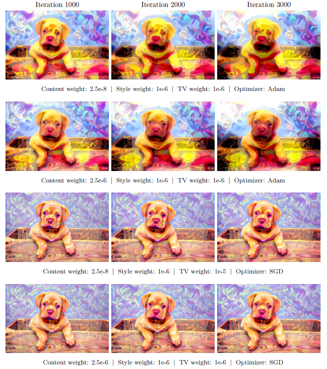
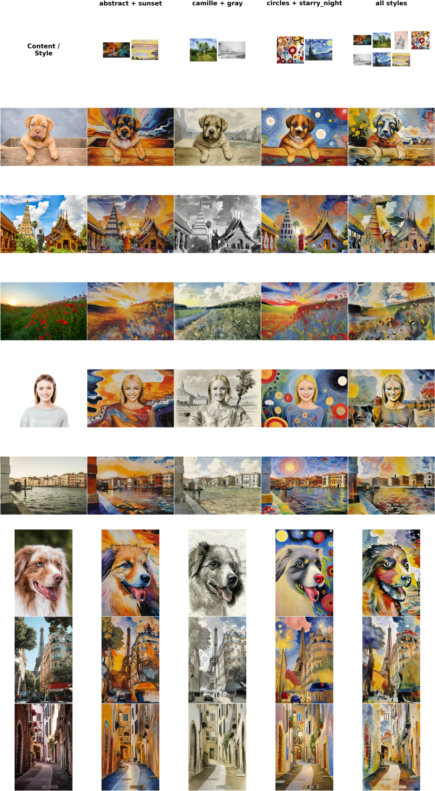
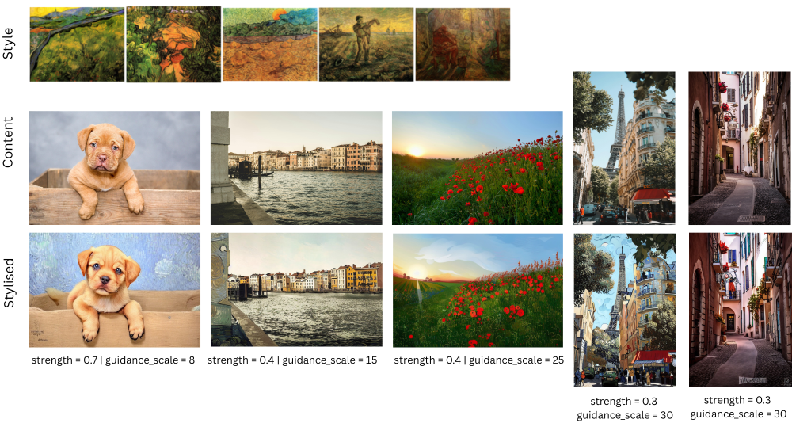
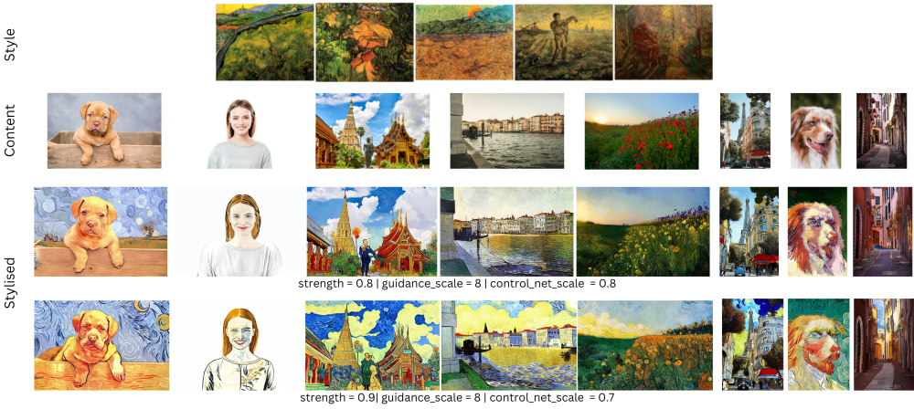

<h1>Neural Style Transfer - Project Template 3.1: Final Project</h1>

## Table of Contents

- [Instructions](#instructions)
  - [Setup](#setup)
- [Classical NST Implementations](#classical-nst-implementations)
  - [Baseline Neural Style Transfer (Optimisation-Based) - Gatys et al.](#1-baseline-neural-style-transfer-optimisation-based--gatys-et-al)
  - [Real-Time Style Transfer (Single Style) - Johnson et al. for BOTH Images and Videos](#2-real-time-style-transfer-single-style--johnson-et-al-for-both-images-and-videos)
  - [Multi-Style Transfer (AdaIN) - Huang et al.](#3-multi-style-transfer-adain--huang-et-al)
- [Diffusion-based NST Implementations](#diffusion-based-nst-implementations)
  - [NST with Stable Diffusion, IP-Adapter and ControlNet](#1-nst-with-stable-diffusion-ip-adapter-and-controlnet)
  - [NST with Stable Diffusion and LoRA Fine-Tuning](#2-nst-with-stable-diffusion-and-lora-fine-tuning)
    - [Training](#21-training)
    - [Inference without ControlNet](#21-inference-without-controlnet)
    - [Inference with ControlNet](#22-inference-with-controlnet)

# Instructions

- **Link to stylised portfolio of images and videos**: [View Portfolio](https://drive.google.com/drive/folders/1J4Mb9XTQUdS7O_ybdBIqgrRz_U8AQ2Yj?usp=drive_link)

These can be found also in the corresponding `output_data` folders, however not all videos are included due to their size.

## Setup

The project uses a virtual environment created in WSL.

Python version used in the project is: `Python 3.12.3`

Create the virtual environment:

```bash
python3 -m venv venv
```

Activate it:

```bash
source venv/bin/activate
```

Install the requirements. This is only for the classical NST implementations:

```bash
pip install -r requirements.txt
```

---

We already have a selected set of content and style images used to test the models.
See folder: `00_input_data`

---

# Classical NST Implementations

The classical NST methods were trained and used for stylization (inference) on my device with NVIDIA RTX 3060 GPU.

These are:

## 1. Baseline Neural Style Transfer (Optimisation-Based) - Gatys et al.

The implementation was taken from:

> F. Chollet, _Deep Learning with Python_, 2nd ed. Shelter Island, NY: Manning Publications Co., 2021, ch. 12.3, pp. 383-390.

- **Go to Folder:** `1_gatys_nst`
- **Stylisation Outputs are in the subfolder:** `output_data/`

We experimented with different optimisers and content/style weights.

### Stylisation examples:



---

## 2. Real-Time Style Transfer (Single Style) - Johnson et al. for BOTH Images and Videos

Implemented based on:

> J. Johnson, A. Alahi, and L. Fei-Fei,
> “Perceptual losses for real-time style transfer and superresolution,” ECCV 2016.

Video stylisation with optical flow based on:

> M. Ruder, A. Dosovitskiy, and T. Brox,
> “Artistic style transfer for videos,” 2016.

- **Go to Folder:** `2_single_nst`
- **Trained Models are in the subfolder:** `models/` (3 trained styles)
- **Image Stylisation Outputs are in the subfolder:** `output_data/images/`
- **Video Stylisation Outputs are in the subfolder:** `output_data/videos/`
  - with Optical Flow: `with_optical_flow/`
  - without Optical Flow: `without_optical_flow/`

### Scripts to run inside the `2_single_nst` folder

Training: `train.py`

Inference (image): `inference.py`

Inference (video with optical flow):`inference_video_opt_flow.py`

Inference (video without optical flow): `inference_video.py`

### Notes

- Ensure paths are correctly set.
- Content data is expected to be included in:
  - `00_input_data/images/01_content`
  - `00_input_data/videos`

- In the scripts (specifically inference) we use **file stems (no extensions)**.

### Stylisation examples:


---

## 3. Multi-Style Transfer (AdaIN) - Huang et al.

Based on:

> X. Huang and S. Belongie,
> “Arbitrary style transfer in real-time with adaptive instance normalization,” 2017.

- **Go to Folder:** `3_adain_nst`
- **Trained Models are in the subfolder:** `models/`
- **Stylisation Outputs are in the subfolder:** `output_data/`

### Scripts to run inside the `3_adain_nst` folder

Training: `train.py`

Inference: `inference.py`

### Notes

- Ensure paths are correctly set.
- Dataset Requirements for training:
  - MS COCO 2017
  - WikiArt

  Place datasets in: `00_input_data/`

- Data Requirements for inference:
  - Put the content image in:
    - `00_input_data/images/01_content`
  - Put the style image in:
    - `00_input_data/images/02_style`

- In the scripts (specifically inference) we use **file stems (no extensions)**.

### Stylisation examples:

- Alpha used: 0.8


---

# Diffusion-based NST Implementations

Since Stable Diffusion models are computationally intensive, we performed training and stylization in **Google Colab** using an NVIDIA Tesla T4 GPU.

- **Go to Folder:** `4_stable_diffusion_nst`
- **Trained Models LoRA are in the subfolder:** `models/`
- **Stylisation Outputs are in the subfolder:** `output_data/`
  - **NST with Stable Diffusion, IP-Adapter and ControlNet:** `ip_adapter_controlnet/`
    - **Stylisation with single style:** `ip_controlnet_single_style/`
      - Note: Inside you will find different subfolder with different hyperparameters experiments.
    - **Stylisation with multiple styles:** `ip_controlnet_multiple_styles/`
      - Note: Inside you will find different subfolder with different hyperparameters experiments.
  - **LoRA:** `lora/`
    - **Stylisation with ControlNet:** `with_controlnet/`
      - Note: Inside you will find different subfolder with different hyperparameters experiments.
    - **Stylisation without ControlNet:** `without_controlnet/`

---

## 1. NST with Stable Diffusion, IP-Adapter and ControlNet

Inference: `ip_adapter_controlnet.ipynb`

Make sure to load the content and style images and check the paths. Since we used Google Colab these might be different when used.

### Stylisation examples:

#### Single Style


#### Multiple Styles



---

## 2. NST with Stable Diffusion and LoRA Fine-Tuning

### 2.1. Training

We have used a selected dataset of Van Gogh images. Make sure to load it correspondingly and check the paths. Since we used Google Colab these might be different when used.

Training: `lora_train.ipynb`

### 2.1. Inference without ControlNet

Use a trained model from `models` folder and selected content images. Make sure to check the paths. Since we used Google Colab these might be different when used.

Inference: `lora_inference_without_controlnet.ipynb`

### Stylisation examples:



### 2.2. Inference with ControlNet

Use a trained model from `models` folder and selected content images. Make sure to check the paths. Since we used Google Colab these might be different when used.

Inference: `lora_inference_controlnet.ipynb`

### Stylisation examples:


